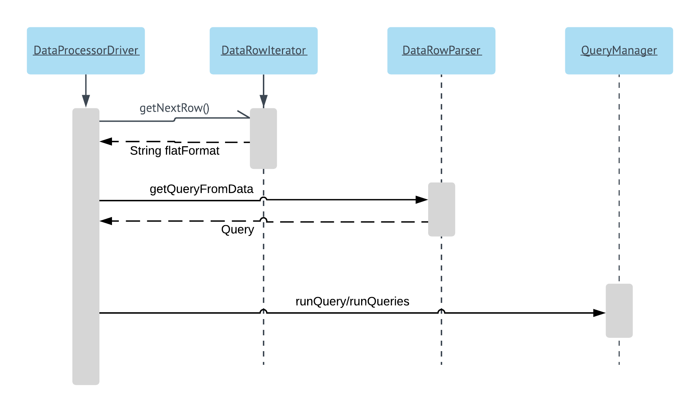
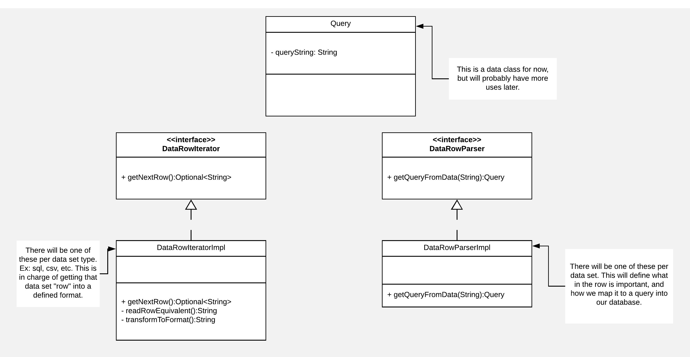

# Data Processing Documentation

## Processor Lifecycle

The end goal for the processor will be an on demand service to get datasets into the cassandra database. The container will be modified to include environment variables that indicate which datasets from the config should be imported. The default state for this environment variable will be all, intended for use when the app is newly deployed.

## Class Design

The data processing section was designed to allow new datasets to be added quickly and efficiently. 

### DataRowIterator
For each new dataset type, a new data row iterator is needed. The intent of this class is to abstract away how the dataset is formatted (csv, sql dump, etc), and provide a common iterface to get bits of the data, sort of like a buffered reader. 

### DataRowParser
For each new dataset, a new data row parser is needed. The intent of this class is to abstract away picking out which fields in the dataset are wanted, and hands back a query that can be run.

### QueryManager
In order to provide flexibility surrounding the running of queries (buffer in memory vs constant querying), the data driver will have access to a query manager that can run a list of queries handed to it. This abstracts away the Cassandra database access. 

## Data Format From Iterator
This will be an ordered list, with the ordering of the fields in the dataset preserved.