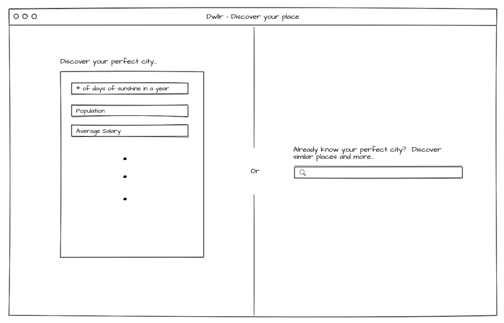
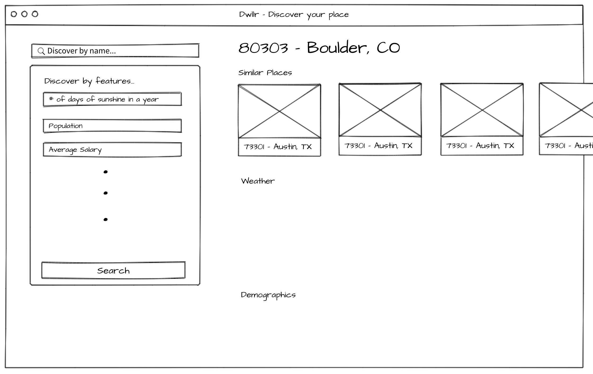

# Dwllr UI Documentation

## Homepage

The front page will look like this on initial loading.  It presents the two options on how to use our service with sentences guiding the uesr on when they should use on or the other.

## Results

After the user submits their search criteria in either the left or right panel above, there will be animations (the two search boxes will presist and animate to their new position shown below: how the other parts will be removed and shown still needs to be decided) with the page turning into the results page below.  

The search boxes and the name of the city will be stickied to the left and top respectively as the user scrolls to explore the results on the right.

In the event that the user serached via feature, the right side will contain 3-4 cities stacked vertically so the user just has to scroll to see their results instead of clicking buttons.  In the event the user searched via city name (which returns only one result), there will be only one result on the right.

New features are easily added to this design as they are only displayed in one place and don't rely on anything.

The background of this reult page will might be a map showing the location of the place, or an 
image of the place grabbed from some API, or just left white.  This is fluff that can be done near the end. 

## To Do's

- Display of errors (e.g. city doesn't exist)
- Color scheme
- Design of each feature 
- Background of results page